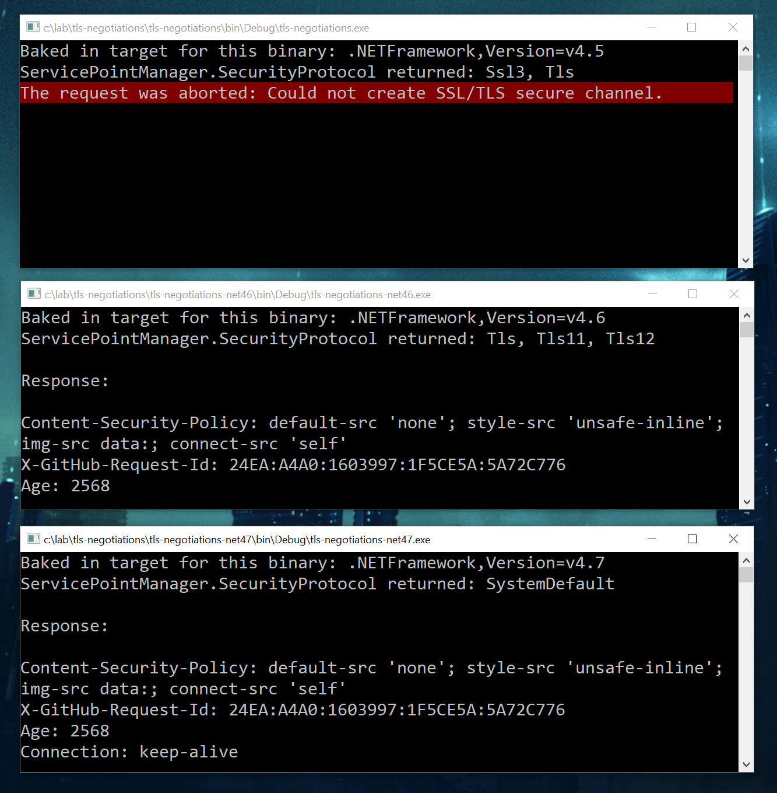
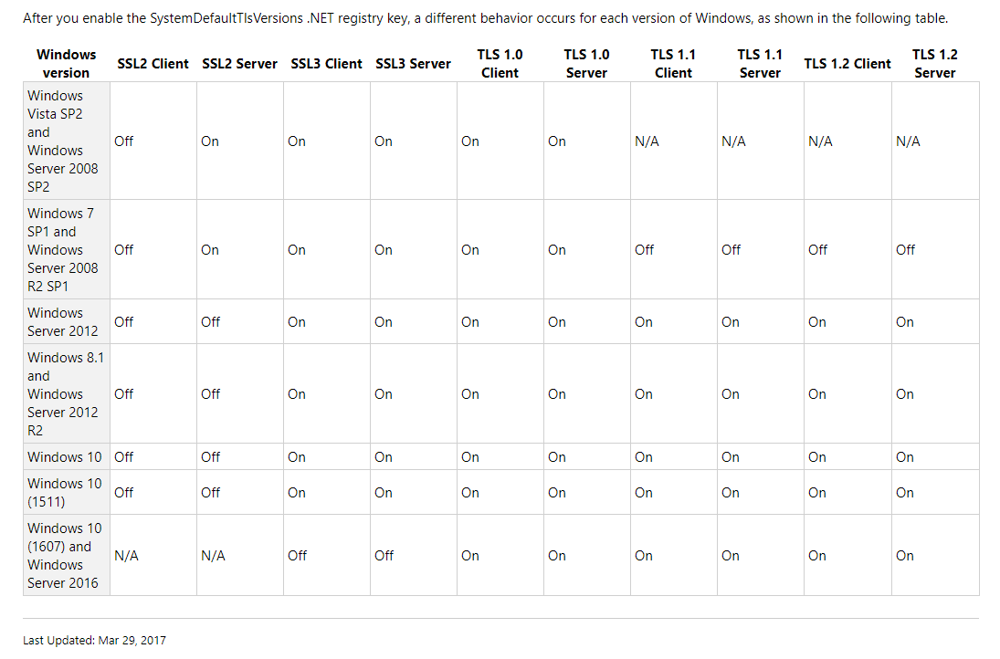

# Top tips

### What's new in .NET Framework 4.7 (CTRL+F for TLS)
https://docs.microsoft.com/en-us/dotnet/framework/whats-new/#v47

### Registry Keys affecting SSL/TLS in SCHANNEL
https://blogs.technet.microsoft.com/cmpfekevin/2016/09/18/schannel-ssl-and-tls-registry-keys-reporting/

```
HKLM SYSTEM\CurrentControlSet\Control\SecurityProviders\SCHANNEL\Protocols\SSL 2.0\Client
HKLM SYSTEM\CurrentControlSet\Control\SecurityProviders\SCHANNEL\Protocols\SSL 2.0\Server
HKLM SYSTEM\CurrentControlSet\Control\SecurityProviders\SCHANNEL\Protocols\SSL 3.0\Client
HKLM SYSTEM\CurrentControlSet\Control\SecurityProviders\SCHANNEL\Protocols\SSL 3.0\Server
HKLM SYSTEM\CurrentControlSet\Control\SecurityProviders\SCHANNEL\Protocols\TLS 1.0\Client
HKLM SYSTEM\CurrentControlSet\Control\SecurityProviders\SCHANNEL\Protocols\TLS 1.0\Server
HKLM SYSTEM\CurrentControlSet\Control\SecurityProviders\SCHANNEL\Protocols\TLS 1.1\Client
HKLM SYSTEM\CurrentControlSet\Control\SecurityProviders\SCHANNEL\Protocols\TLS 1.1\Server
HKLM SYSTEM\CurrentControlSet\Control\SecurityProviders\SCHANNEL\Protocols\TLS 1.2\Client
HKLM SYSTEM\CurrentControlSet\Control\SecurityProviders\SCHANNEL\Protocols\TLS 1.2\Server
```

### Control SCHANNEL ciphers
https://support.microsoft.com/en-us/help/245030/how-to-restrict-the-use-of-certain-cryptographic-algorithms-and-protoc

### TLS System Default Versions in Windows
From https://support.microsoft.com/en-us/help/3154520/support-for-tls-system-default-versions-included-in-the--net-framework:


### How's my SSL?
  * https://www.howsmyssl.com/
  * JSON response: https://www.howsmyssl.com/a/check

### Qualys SSL Labs (Ivan Ristic)
  * https://www.ssllabs.com/ssltest/
  * API Documentation: https://github.com/ssllabs/ssllabs-scan/blob/stable/ssllabs-api-docs.md

### SSL Labs one-version-only listeners (Thank you, Ivan!)
  * **SSL 3.0**-only listener at https://ssllabs.com:10300/
  * **TLS 1.0**-only listener at https://ssllabs.com:10301/
  * **TLS 1.1**-only listener at https://ssllabs.com:10302/
  * **TLS 1.2**-only listener at https://ssllabs.com:10303/

### Listen for specific protocol version locally

```bash
# Generate self-signed certificate
$ openssl req -x509 -newkey rsa:2048 -keyout key.pem -out cert.pem -days 365 -nodes

# Spin up a simple web server on port 4433 that talks one protocol version only
$ openssl s_server -key key.pem -cert cert.pem -accept 4433 -www -tls1

 # -ssl3         - just use SSLv3
 # -tls1_2       - just use TLSv1.2
 # -tls1_1       - just use TLSv1.1
 # -tls1         - just use TLSv1
```

### Handshake specific protocol version with remote host

```
# openssl s_client -h

 # -ssl3         - just use SSLv3
 # -tls1_2       - just use TLSv1.2
 # -tls1_1       - just use TLSv1.1
 # -tls1         - just use TLSv1

$ openssl s_client -host pages.github.io -port 443 -servername pages.github.io -tls1_2

CONNECTED(00000003)
---
Certificate chain
 0 s:/C=US/ST=California/L=San Francisco/O=GitHub, Inc./CN=www.github.com
   i:/C=US/O=DigiCert Inc/OU=www.digicert.com/CN=DigiCert SHA2 High Assurance Server CA
 1 s:/C=US/O=DigiCert Inc/OU=www.digicert.com/CN=DigiCert SHA2 High Assurance Server CA
   i:/C=US/O=DigiCert Inc/OU=www.digicert.com/CN=DigiCert High Assurance EV Root CA
---
Server certificate
-----BEGIN CERTIFICATE-----
MIIHqDCCBpCgAwIBAgIQCDqEWS938ueVG/iHzt7JZjANBgkqhkiG9w0BAQsFADBw
...
3svH64hwWd1i3BZ2LTBq46MvQKU2D8wFdtXgbgRAPWohX79Oo6hs0Jghub0=
-----END CERTIFICATE-----
subject=/C=US/ST=California/L=San Francisco/O=GitHub, Inc./CN=www.github.com
issuer=/C=US/O=DigiCert Inc/OU=www.digicert.com/CN=DigiCert SHA2 High Assurance Server CA
---
...
---
SSL handshake has read 3846 bytes and written 455 bytes
---
New, TLSv1/SSLv3, Cipher is ECDHE-RSA-AES128-GCM-SHA256
Server public key is 2048 bit
Secure Renegotiation IS supported
Compression: NONE
Expansion: NONE
No ALPN negotiated
SSL-Session:
    Protocol  : TLSv1.2
    Cipher    : ECDHE-RSA-AES128-GCM-SHA256
    ...
    Start Time: 1517480966
    Timeout   : 7200 (sec)
    Verify return code: 0 (ok)
---
```

### Enumerate remote ciphers with `nmap`

```bash
$ sudo apt install nmap -y

$ nmap -sV --script ssl-enum-ciphers -p 443 pages.github.io

Nmap scan report for pages.github.io (151.101.37.147)

PORT    STATE SERVICE        VERSION
443/tcp open  ssl/http-proxy Varnish
|_http-server-header: GitHub.com
| ssl-enum-ciphers:
|   TLSv1.2:
|     ciphers:
|       TLS_ECDHE_RSA_WITH_AES_128_GCM_SHA256 (rsa 2048) - A
|       TLS_ECDHE_RSA_WITH_AES_256_GCM_SHA384 (rsa 2048) - A
|       TLS_ECDHE_RSA_WITH_AES_128_CBC_SHA256 (rsa 2048) - A
|       TLS_ECDHE_RSA_WITH_AES_256_CBC_SHA384 (rsa 2048) - A
|       TLS_ECDHE_RSA_WITH_AES_128_CBC_SHA (rsa 2048) - A
|       TLS_ECDHE_RSA_WITH_AES_256_CBC_SHA (rsa 2048) - A
|       TLS_RSA_WITH_AES_128_GCM_SHA256 (rsa 2048) - A
|       TLS_RSA_WITH_AES_128_CBC_SHA (rsa 2048) - A
|       TLS_RSA_WITH_AES_256_CBC_SHA (rsa 2048) - A
|     compressors:
|       NULL
|     cipher preference: server
|_  least strength: A
```

### Traffic Analysis of an SSL/TLS Session
http://blog.fourthbit.com/2014/12/23/traffic-analysis-of-an-ssl-slash-tls-session

```
  03 00          SSL version (SSL 3.0)
  03 01          SSL version (TLS 1.0)
  03 02          SSL version (TLS 1.1)
  03 03          SSL version (TLS 1.2)
  03 03          SSL version (TLS 1.3), negotiates version 1.3 through protocol extension

---

ServerHello message

0000   16 03 01 00 35 02 00 00 31 03 01 54 9a ab 72 85  ....5...1..T..r.
0010   91 a4 a7 a9 27 fe 3d e4 da f6 38 a5 aa 6e 5a 2f  ....'.=...8..nZ/
0020   31 90 5b 41 b0 5d de d8 9d ae f6 00 00 35 00 00  1.[A.].......5..
0030   09 ff 01 00 01 00 00 23 00 00                    .......#..

       16             Handshake protocol type
       03 01          SSL version (TLS 1.0)
       35             Record length (53 bytes)

       02             ServerHello message type
       00 00 31       Message length (49 bytes)
       03 01          SSL version (TLS 1.0)
       54 9a ab 72    First 4 bytes of random (Unix time)
       85 .. f6       Last 28 bytes of the random number
       00             Session Id length
       00 35          Selected Cipher Suite (RSA with AES-256-CBC SHA)
       00             Selected compression method (null)
       00 09          Extensions length
       ff 01 00 01 00 Extension (Renegotiation Info)
       00 23 00 00    Extension (SessionTicket TLS)
```
